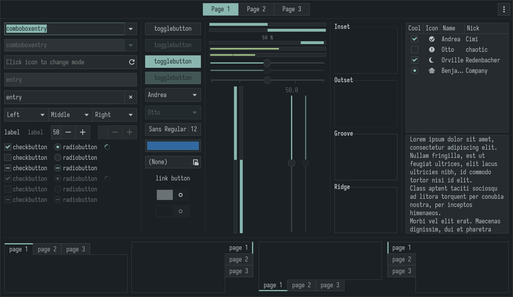
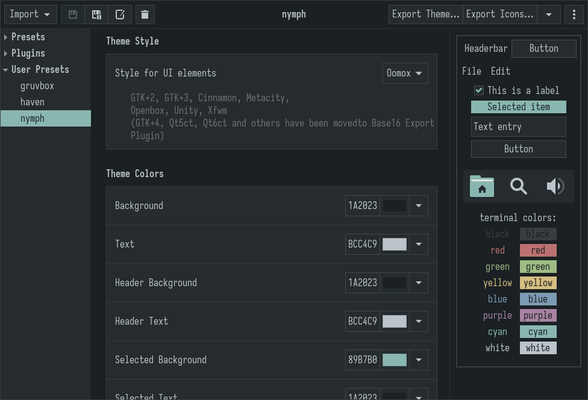

## Preview

    
    

## Installation

1. Install [themix/oomox theme designer](https://github.com/themix-project/themix-gui)
2. Copy `oomox` folder to `~/.config` and open themix gui app
3. Export theme and icons from user presets