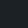
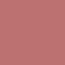
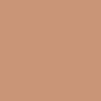
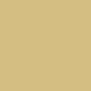
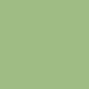
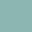
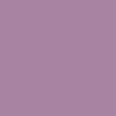

## Colors

| Preview                                              | Name              | Hex      | RGB             | HSL           |
| ---------------------------------------------------- | ----------------- | -------- | --------------- | ------------- |
|         | Background        | `1A2023` | `26, 32, 35`    | `200, 26, 14` |
|     | Background Alt    | `252B2E` | `37, 43, 46`    | `200, 20, 18` |
|  | Background Urgent | `373D40` | `55, 61, 64`    | `200, 14, 25` |
|     | Foreground Alt    | `5B6265` | `91, 98, 101`   | `198, 10, 40` |
|         | Foreground        | `BCC4C9` | `188, 196, 201` | `203, 6, 79`  |
|                | Red               | `BC7171` | `188, 113, 113` | `0, 40, 74`   |
|             | Orange            | `C99577` | `201, 149, 119` | `22, 41, 79`  |
|             | Yellow            | `D5BE82` | `213, 190, 130` | `43, 39, 84`  |
|              | Green             | `9FBC85` | `159, 188, 133` | `92, 29, 74`  |
|               | Cyan (Accent)     | `89B7B0` | `137, 183, 176` | `171, 25, 72` |
|               | Blue              | `7C9BB4` | `124, 155, 180` | `207, 31, 71` |
|            | Magenta           | `A883A2` | `168, 131, 162` | `310, 22, 66` |

## Ports

<h4><a href='https://github.com/myagko/nymph/tree/Alacritty'>Alacritty</a></h4>
<h4><a href='https://github.com/myagko/nymph/tree/Nvim'>Neovim</a></h4>